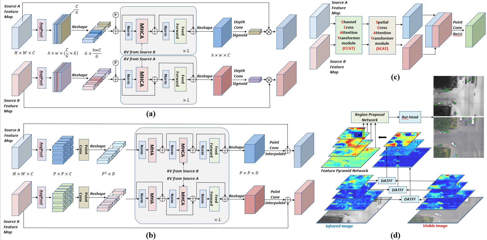

# Dual Attention Transformer Fusion (DATFF) Module 

This is the code for our ICANN2023 paper 'Dual Attention Feature Fusion for Visible-Infrared Object Detection'.

## About the code

To use the code, you should first create a python virtual env to install mmcv-full==1.7.0. Then you can install mmdetection==2.26.0 and mmrotate==0.3.4. Note that your mmrotate should be built on mmdetection that you have installed.

We only present the modifications we have made to the mmdetection/mmrotate codebase. For example, you should add the code in mmdetection/mmdet/datasets/pipelines/loading.py to your mmdetection.

Finally, don't forget to register all the newly-added classes in '\_\_init\_\_.py'.

## About the DroneVehicle dataset

You can find the annotations(Folders: trainlabelrtxt, vallabelrtxt, testlabelrtxt) and image lists(train.txt, val.txt, test.txt) from this Google Disk link: 
https://drive.google.com/drive/folders/1ZXOgmTk5_Tvz464vzclHJyZ1tv41GEYu?usp=drive_link

You can find the images(Folders: trainimgr, trainimg, valimgr, valimg, testimgr, testimg) from the DroneVehicle dataset Github page(https://github.com/VisDrone/DroneVehicle).